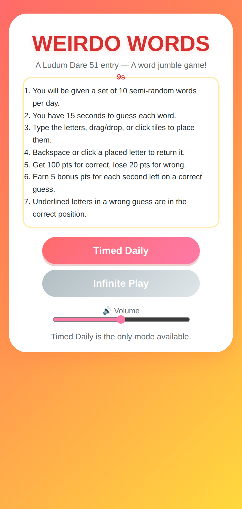
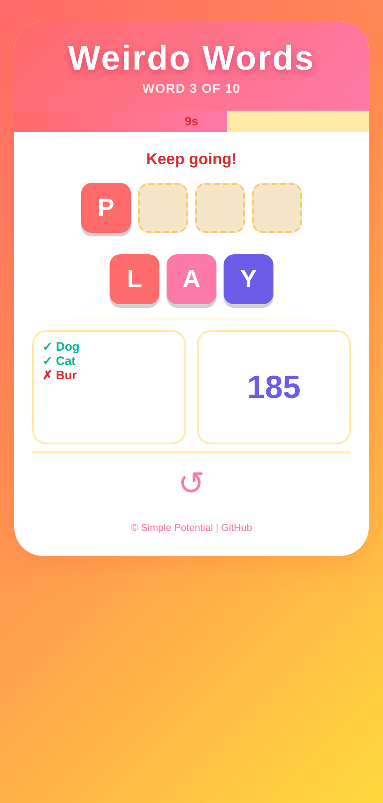
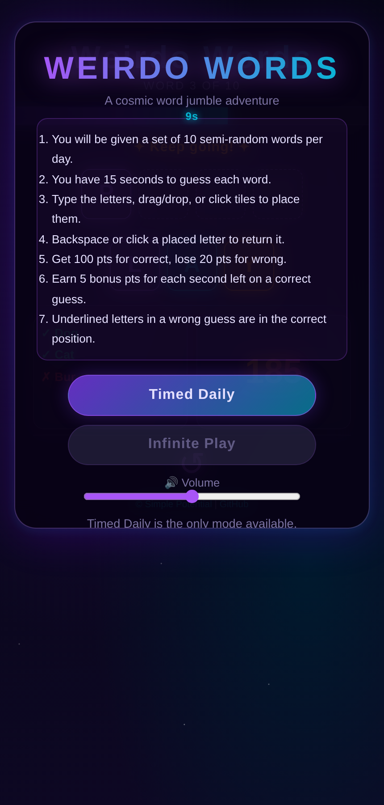
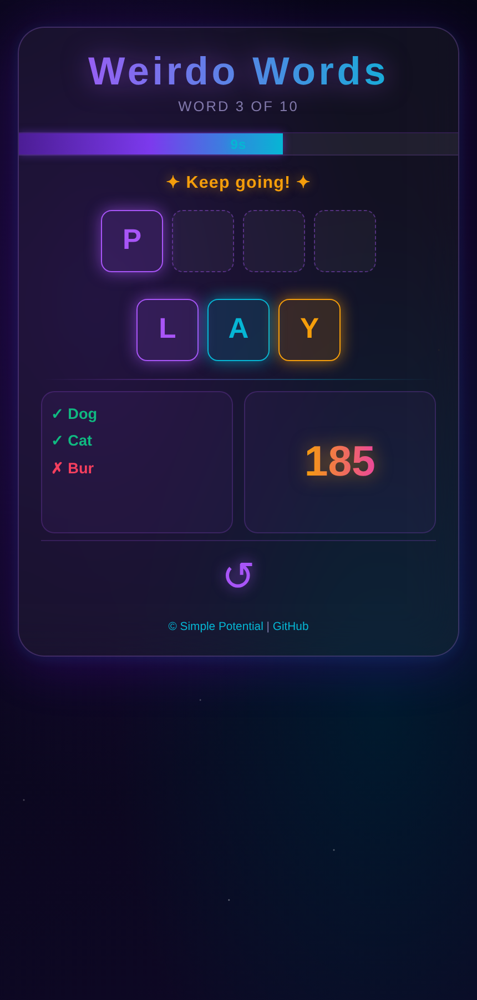
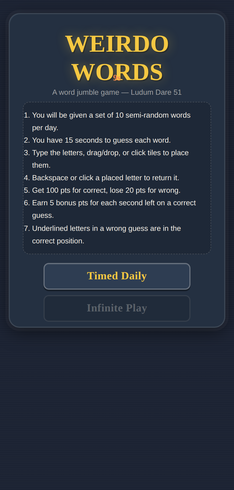
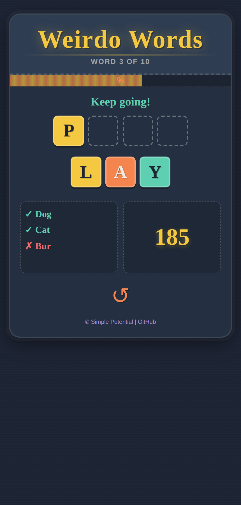

# Weirdo Words – Design Proposals

Three distinct visual redesigns of the Weirdo Words game.
Each is a **standalone HTML file** — open it in a browser to preview.
None of the original game files (`game.htm`, `game.css`, `game.js`) have been modified.

> **Demo tip:** On the main-menu screen, click anywhere outside the buttons to reveal the game board behind it.

---

## Design 1 – Tropical Burst (`design1.html`)

| Menu | Game board |
|:---:|:---:|
|  |  |

**Vibe:** Sunny, high-energy, candy-coloured. Like a vacation in your pocket.

| Token | Value |
|---|---|
| Background | Warm coral-to-yellow gradient |
| Card | Pure white, 2rem rounded corners, colour-tinted drop shadow |
| Letter tiles | Solid candy colours (coral, pink, purple, teal, orange, green, amber) — white uppercase letters, 4px bottom shadow so they look pressable |
| Empty slots | Cream fill, dashed amber border |
| Timer bar | Coral → hot-pink gradient |
| Score display | Bold purple number |
| Buttons (menu) | Coral/pink gradient pill — "jelly button" hover lift |
| Font | **Nunito** (rounded, friendly, very legible at small sizes) |

**Why it works:**  
The warm gradient body sets an immediately cheerful mood. The coloured tile system (each tile gets a different hue automatically cycling) makes the letter pool visually scannable at a glance — you don't read every letter, you spot them by colour too. Pill-shaped buttons with a tactile shadow reinforce the mobile-game feel. The layout stacks neatly on a 375px phone all the way up to a 44rem desktop column.

---

## Design 2 – Midnight Galaxy (`design2.html`)

| Menu | Game board |
|:---:|:---:|
|  |  |

**Vibe:** Deep-space elegance. Feels like a premium puzzle app.

| Token | Value |
|---|---|
| Background | Near-black deep-space gradient with subtle CSS star field |
| Card | Glassmorphism — translucent dark panel, frosted-blur, purple-tinted border |
| Letter tiles | Semi-transparent dark panels with neon-coloured text + outer glow (purple, teal, gold, pink, green cycle) |
| Empty slots | Near-transparent with dashed purple border |
| Timer bar | Deep violet → electric cyan gradient with glow |
| Score display | Gold-to-pink gradient text with drop shadow |
| Buttons (menu) | Translucent violet panel, cyan/purple border, neon glow on hover |
| Font | **Space Grotesk** (geometric, modern, excellent at all sizes) |

**Why it works:**  
The glassmorphism card sits against a star-field body so the whole composition breathes — the game doesn't feel cramped on mobile because the body itself is part of the scene. Neon-glow tiles on a dark background create strong contrast while the glowing colours make the interaction feel electric. The gradient score and title add sophistication without being distracting.

---

## Design 3 – Chalk & Slate (`design3.html`)

| Menu | Game board |
|:---:|:---:|
|  |  |

**Vibe:** Playful classroom, analogue warmth. Like scribbling on a chalkboard.

| Token | Value |
|---|---|
| Background | Dark slate blue with very subtle horizontal line texture |
| Card | Medium slate panel, dashed chalk-white border, chalkboard panel feel |
| Letter tiles | Solid chalk colours (yellow, orange, mint, lavender, coral, sky-blue, pink, lime) with slight inner-highlight bevel — look like chalk pieces |
| Empty slots | Transparent with dashed chalk-white border |
| Timer bar | Stripe-pattern of orange/yellow to suggest chalk strokes |
| Score display | Chunky hand-written yellow number |
| Buttons (menu) | Slate box with chalk-yellow text + dashed border, highlights on hover |
| Fonts | **Caveat** (handwritten, playful) for title/score/timer; **Nunito** for body text |

**Why it works:**  
The chalkboard metaphor is familiar and nostalgic but the execution is modern — clean layout, big touch targets, mobile-first widths. The `Caveat` font makes tiles and headings feel hand-crafted without sacrificing legibility. The dashed borders throughout reinforce the "drawn on a board" aesthetic in a subtle, cohesive way. Individual tile colours cycle through a warm+cool palette so the jumble area is always visually interesting.

---

## Choosing a Design

All three designs:
- Are **mobile-first** (375px base, max-width 44rem on desktop)
- Maintain the exact **game layout** and interactive structure
- Use only **CSS custom properties** (easy to tweak individual colours)
- Provide **large touch targets** (≥ 3.4rem tile minimum)
- Keep **accessible contrast** on key interactive elements

To apply a chosen design to the real game, the main changes needed are:
1. Replace `game.css` with the `<style>` block from the chosen design file
2. Optionally add the chosen `<link>` font import to `game.htm`
3. Add the `.game-header` wrapper `
` around `#gameTitle` and `#word_of_word` in `game.htm` (Designs 1 & 3 use this for the coloured header band)
